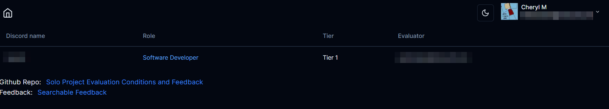
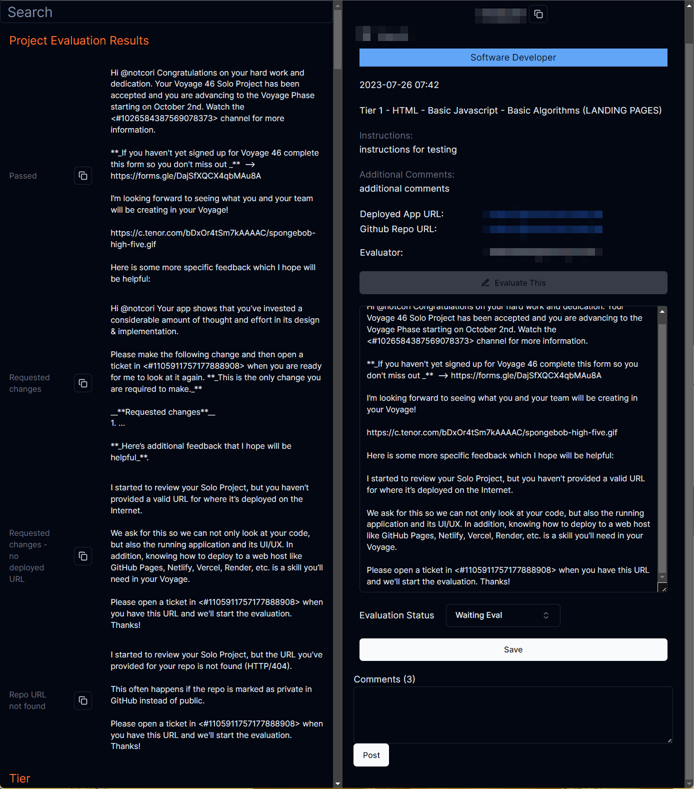
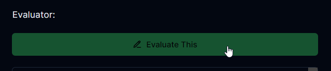
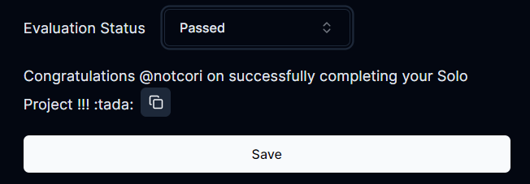
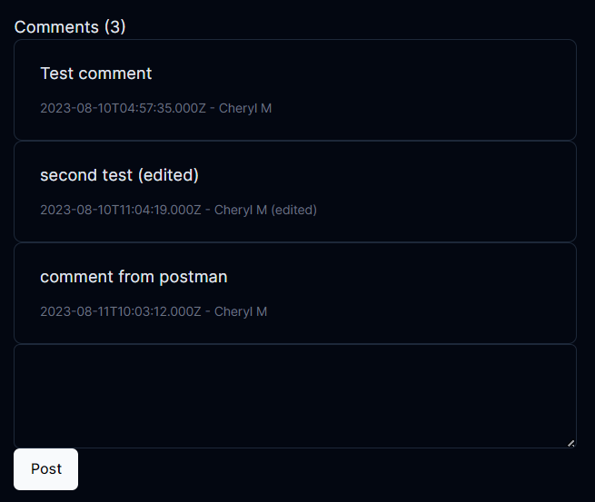
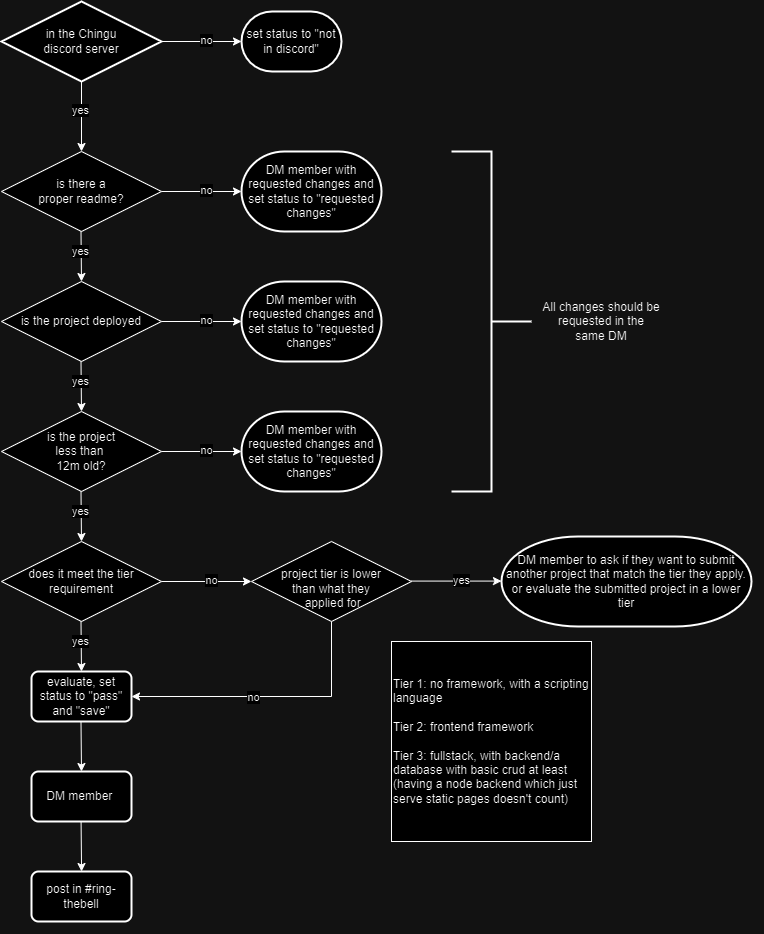

<!-- Improved compatibility of back to top link: See: https://github.com/othneildrew/Best-README-Template/pull/73 -->
<a name="readme-top"></a>
<!--
*** Thanks for checking out the Best-README-Template. If you have a suggestion
*** that would make this better, please fork the repo and create a pull request
*** or simply open an issue with the tag "enhancement".
*** Don't forget to give the project a star!
*** Thanks again! Now go create something AMAZING! :D
-->


<!-- PROJECT SHIELDS -->
<!--
*** I'm using markdown "reference style" links for readability.
*** Reference links are enclosed in brackets [ ] instead of parentheses ( ).
*** See the bottom of this document for the declaration of the reference variables
*** for contributors-url, forks-url, etc. This is an optional, concise syntax you may use.
*** https://www.markdownguide.org/basic-syntax/#reference-style-links
-->
[![Contributors][contributors-shield]][contributors-url]
[![Forks][forks-shield]][forks-url]
[![Stargazers][stars-shield]][stars-url]
[![Issues][issues-shield]][issues-url]
[![MIT License][license-shield]][license-url]


<!-- PROJECT LOGO -->
<br />
<div align="center">
  <a href="https://github.com/github_username/repo_name">
    
  </a>

<h3 align="center">Chingu Solo Project Evaluation</h3>

  <p align="center">
    An application which helps with chingu.io solo project evaluation
    <br />
    <a href="https://github.com/github_username/repo_name"><strong>Explore the docs »</strong></a>
    <br />
    <br />
    <a href="https://github.com/cherylli/chingu-soloproject-evaluation-app/issues">Report Bug</a>
    ·
    <a href="https://github.com/cherylli/chingu-soloproject-evaluation-app/issues">Request Feature</a>
  </p>
</div>


<!-- TABLE OF CONTENTS -->
<details>
  <summary>Table of Contents</summary>
  <ol>
    <li>
      <a href="#about-the-project">About The Project</a>
      <ul>
        <li><a href="#built-with">Built With</a></li>
      </ul>
    </li>
    <li>
      <a href="#getting-started">Getting Started</a>
      <ul>
        <li><a href="#prerequisites">Prerequisites</a></li>
        <li><a href="#installation">Installation</a></li>
      </ul>
    </li>
    <li><a href="#usage">Usage</a></li>
    <li><a href="#roadmap">Roadmap</a></li>
    <li><a href="#license">License</a></li>
    <li><a href="#contact">Contact</a></li>
    </a></li>
  </ol>
</details>


<!-- ABOUT THE PROJECT -->
## About The Project

[![Product Name Screen Shot][product-screenshot]](https://example.com)

This application allows user to evaluate solo projects without needing to have direct access to airtable which access is charged per person. It also has features which improves the efficiency of chingu.io solo project evaluation. 

It requires user to be authenticated using github OAuth, then users will be authorized based their roles which is stored in the Chingu airtable.

Feedback is scraped from the [soloproject-evaluation](https://github.com/chingu-voyages/soloproject-evaluation) repository.

## Screenshots
The home screen shows a list of projects to be evaluated, click on the `Discord name` to go to the detail view


Feedback are shown side-by-side in the desktop view


<p align="right">(<a href="#readme-top">back to top</a>)</p>


### Built With

[![Next][Next.js]][Next-url]
<br/>
[](https://tailwindcss.com/)
<br/>
[![shadcn/ui][ShadcnUI]][ShadcnUI-url]
<br/>
[](http://www.typescriptlang.org/)
<br/>
[](https://airtable.com/)


<p align="right">(<a href="#readme-top">back to top</a>)</p>


<!-- GETTING STARTED -->
## Getting Started

### Prerequisites

To be able to login, you will need (please contact a Chingu admin)
* an entry in the chingu admin airtable to be able to login with your github account
* an existing option in the Evaluation dropdown on airtable

<p align="right">(<a href="#readme-top">back to top</a>)</p>


<!-- USAGE EXAMPLES -->
## Usage

### 1. Pick a project to evaluate from the home screen. 
Projects with an empty "Evaluator" field is unclaimed and available for evaluation.
<br/>
<b>Note:</b> Product Owner or Scrum Master solo projects are evaluated by the Agile Leadership team. 
<br/>

### 2. Before doing anything, claim the project by clicking on the `Evaluate This` button. 
This will set the `Evaluator`, and `Evaluation Date` fields in airtable, and the button will be greyed out on success.
<br/>
This is to ensure that we don't have multiple evaluators work on the same solo project.
<br/><br/>

    

### 3. Enter your feedback in the textarea
 
   [](https://i.imgur.com/2cMunDS.png)

Here are some sample feedback (https://github.com/chingu-voyages/soloproject-evaluation#example-feedback) <br/>
<br/>
   We copy and paste some pre-defined feedback from the feedback pane but feel free to use your own or add to our collection of feedback by making a pull request in the feedback repository where you can find the link in frontpage of the app.
<br/><br/>
<b>Note</b>: we don't include feedback with "requested changes" now, as most of the time we don't get a response from them

So with a `requested changes` project, we would send something like

   [](https://i.imgur.com/IWdKBcj.png)

It's also a good idea to put a note in the comment section about why we are requesting for changes so it's easier for other evaluators and admin to see if they open a ticket.
<br/><br/>
In this case, we don't need to have the `evaluator` field set if it's moved quick enough to the `requested changes` status (remember to save). So anyone is free to evaluate it when it gets moved back to the `Waiting Eval` status.
<br/><br/>
A list of requested change conditions can be found in the flowchart below.


### 4. Select the appropriate 'Evaluation Status', and click `Save`
<br/>
This will save the feedback into the `Evaluation Feedback` field in airtable, and a save confirmation should be displayed on success. (browser alert at this stage)


<br/><br/>
    <u>Evaluation Statuses</u>
<br/>
    <b>Waiting Eval</b> - Projects awaiting evaluation
    <br/><br/>
    <b>Passed</b> - The project has satisfied all the requirements for the tier they applied for
    <br/><br/>
    <b>Requested Changes</b> - Changes are requested. Participants are asked to open a ticket. 
    Once they opened a ticket with the additional changes/information, an admin will put it back in the evaluation queue. 
    We also have an automation to email everyone with the "requested changes".
    Sometimes, they will directly respond to the evaluator in DM which is OK, only issue is that it may take longer for us to action as the particular evaluator might not be available to re-evaluate in a timely manner
   <br/><br/>
   <b>Not In Discord</b> - Participant cannot be located in discord. 


### 5. Copy the congratulations message and send it in #ring-the-bell channel on discord
   
### 6. DM member with the feedback on discord

Note: Comments can also be added if necessary. Due to the limitations of the airtable API, all comments will be shown as posted by the person who owns the API key, regardless of the user logged in




<p align="right">(<a href="#readme-top">back to top</a>)</p>



<!-- ROADMAP -->
## Roadmap

- [x] Authentication with github, so we don't have to store user credentials
- [x] A better confirmation display for actions (save, set evaluator), an alert box is used currently
- [x] Add Loading state to actions (e.g. save, set evaluator)
- [ ] (Possibly) role based auth for additional admin features 
- [x] Auto scrape feedback repo every x days -> added this but autoscrape every time the feedback repo is updated
- [ ] Save evaluation text in context so progress is not lose on page navigation
- [ ] Comments
  - [x] Show comments
  - [x] Add comments
  - [ ] Edit/Delete comments (not sure if I want to implement this)
- [x] Feedback 
  - [x] copy and paste
  - [x] searchable
- [x] Copy and paste "ring-the-bell" comments
- [ ] Copy and paste feedback based on character count (discord free account limitation)
- [ ] Refactor to add context for functions like setEvaluator, update record, instead of prop drilling
- [ ] Allow posting messages on discord from the app
- [ ] Allow sending emails from the app

See the [open issues](https://github.com/cherylli/chingu-soloproject-evaluation-app/issues) for a full list of proposed features (and known issues).

<p align="right">(<a href="#readme-top">back to top</a>)</p>

## Contribution

1. Setup required API keys 
2. Clone the repo
   ```sh
   git clone https://github.com/cherylli/chingu-soloproject-evaluation-app
   ```
3. Install NPM packages
   ```sh
   yarn install
   ```
4. Rename `.env.example` to `.env.local` and add API keys
5. Setup test airtable tables if required. Airtable structures can be found [here](/docs/AIRTABLE.md)

<p align="right">(<a href="#readme-top">back to top</a>)</p>


<!-- LICENSE -->
## License

[GNU General Public License V3](https://www.gnu.org/licenses/gpl-3.0)

<p align="right">(<a href="#readme-top">back to top</a>)</p>


<!-- CONTACT -->
## Contact

Cheryl Murphy - [cherylli](https://github.com/cherylli) - https://github.com/cherylli

Project Link: [https://github.com/cherylli/chingu-soloproject-evaluation-app](https://github.com/cherylli/chingu-soloproject-evaluation-app)

<p align="right">(<a href="#readme-top">back to top</a>)</p>


<!-- MARKDOWN LINKS & IMAGES -->
<!-- https://www.markdownguide.org/basic-syntax/#reference-style-links -->
[contributors-shield]: https://img.shields.io/github/contributors/cherylli/chingu-soloproject-evaluation-app.svg?style=for-the-badge
[contributors-url]: https://github.com/cherylli/chingu-soloproject-evaluation-app/graphs/contributors
[forks-shield]: https://img.shields.io/github/forks/cherylli/chingu-soloproject-evaluation-app.svg?style=for-the-badge
[forks-url]: https://github.com/cherylli/chingu-soloproject-evaluation-app/network/members
[stars-shield]: https://img.shields.io/github/stars/cherylli/chingu-soloproject-evaluation-app.svg?style=for-the-badge
[stars-url]: https://github.com/cherylli/chingu-soloproject-evaluation-app/stargazers
[issues-shield]: https://img.shields.io/github/issues/cherylli/chingu-soloproject-evaluation-app.svg?style=for-the-badge
[issues-url]: https://github.com/cherylli/chingu-soloproject-evaluation-app/issues
[license-shield]: https://img.shields.io/github/license/cherylli/chingu-soloproject-evaluation-app.svg?style=for-the-badge
[license-url]: https://github.com/cherylli/chingu-soloproject-evaluation-app/blob/master/LICENSE.md
[product-screenshot]: images/screenshot.png
[Next.js]: https://img.shields.io/badge/next.js-000000?style=for-the-badge&logo=nextdotjs&logoColor=white
[Next-url]: https://nextjs.org/
[ShadcnUI]: https://img.shields.io/badge/SHADCN/UI-black
[ShadcnUI-url]: https://ui.shadcn.com/
